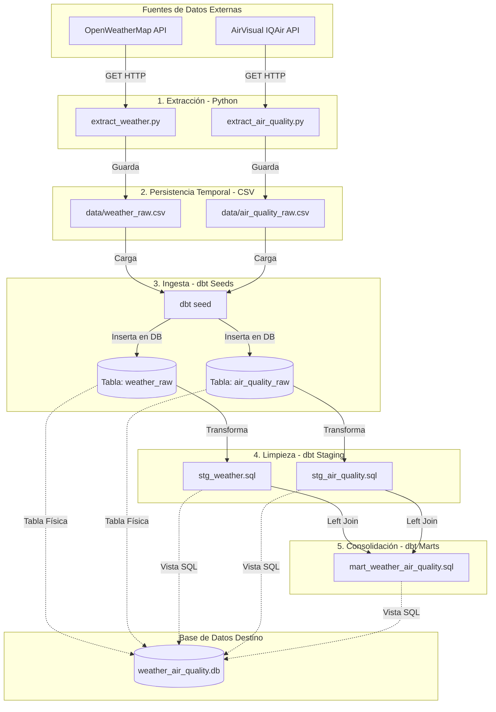

# Arquitectura del Pipeline: Clima + Calidad del Aire

Este documento detalla la arquitectura, el flujo de datos y los procesos de transformación del proyecto **Git4Scale**. Este pipeline está diseñado bajo los principios de ingeniería de datos modernos, utilizando **Python** para la extracción (ETL) y **dbt (data build tool)** junto con **SQLite** para la carga, transformación y validación de datos.

---

## 1. Diagrama del Flujo de Datos

El siguiente diagrama ilustra cómo fluyen los datos desde las APIs de origen hasta el modelo analítico final:



---

## 2. Componentes del Pipeline

La arquitectura sigue el patrón de diseño de **Arquitectura de Medallón** adaptado a un entorno local de desarrollo:

### Fase 1: Extracción (Python ETL)
Dos scripts de Python se encargan de conectarse a las APIs externas, validar las respuestas y estructurar los datos en archivos CSV:

1. **`extract_weather.py`**:
   - Conexión con la API de **OpenWeatherMap**.
   - Descarga datos del clima actual (temperatura en °C, sensación térmica, humedad, presión, velocidad y dirección del viento, condición climática y timestamp) para un grupo de ciudades clave (Londres, Nueva York, Tokio, Sídney).
   - Guarda los resultados en `data/weather_raw.csv`.

2. **`extract_air_quality.py`**:
   - Conexión con la API de **AirVisual (IQAir)**.
   - Extrae el Índice de Calidad del Aire (AQI), contaminante principal, y métricas de clima complementarias.
   - **Nota de diseño**: La API de AirVisual es estricta con la nomenclatura geográfica. Se configuró para usar nombres completos oficiales en inglés (ej. `state: "New South Wales"`, `country: "Australia"`) para evitar errores `400 Bad Request`.
   - Guarda los resultados en `data/air_quality_raw.csv`.

---

### Fase 2: Ingesta (Fase Bronce / Raw)
- **`dbt seed`**: dbt lee los archivos CSV de la carpeta `data/` (configurado en `dbt_project.yml` mediante `seed-paths: ["../data"]`) y los carga en la base de datos SQLite `weather_air_quality.db`.
- Esto genera las tablas físicas de datos crudos: `weather_raw` y `air_quality_raw`. Esto nos permite versionar datos de prueba y tener un punto de partida consistente.

---

### Fase 3: Limpieza y Estandarización (Fase Plata / Staging)
En esta etapa, se limpian y estandarizan los datos provenientes de la fase Bronce mediante vistas SQL de dbt. Las transformaciones de staging no contienen lógica de negocio compleja, solo limpieza:

1. **`stg_weather`** ([stg_weather.sql](file:///c:/Proyectos/knowmads/workshops/git4scale/dbt/models/stg_weather.sql)):
   - Selecciona los datos de la tabla `weather_raw`.
   - Filtra registros donde la temperatura sea nula.
   - Renombra la columna `timestamp` a `weather_timestamp` para evitar colisiones de nombres.

2. **`stg_air_quality`** ([stg_air_quality.sql](file:///c:/Proyectos/knowmads/workshops/git4scale/dbt/models/stg_air_quality.sql)):
   - Selecciona los datos de la tabla `air_quality_raw`.
   - Filtra registros donde el `aqi` sea nulo.
   - Renombra la columna `timestamp` a `aq_timestamp`.

---

### Fase 4: Consolidación y Negocio (Fase Oro / Marts)
- **`mart_weather_air_quality`** ([mart_weather_air_quality.sql](file:///c:/Proyectos/knowmads/workshops/git4scale/dbt/models/mart_weather_air_quality.sql)):
  - Une la información de clima y calidad del aire.
  - **Estrategia de Join**: Dado que las APIs se llaman con unos segundos de diferencia y los timestamps exactos pueden variar, el `LEFT JOIN` se realiza utilizando la **ciudad** y únicamente la **fecha** (`date(weather_timestamp) = date(aq_timestamp)`).
  - Produce un modelo unificado listo para ser consumido por herramientas de Business Intelligence o análisis de datos.

---

## 3. Calidad y Pruebas (dbt Tests)

Para garantizar la confiabilidad del pipeline bajo la metodología de Trunk-Based Development, se ejecutan pruebas automáticas especificadas en `dbt/models/schema.yml` y `dbt/tests/`:

- **Pruebas de Esqueleto (Schema Tests)**:
  - Validaciones de no nulidad (`not_null`) en campos clave como `city`, `temperature` y `aqi`.
  - Validación de rango aceptado (`accepted_range`) para asegurar que la temperatura esté entre -50°C y 60°C, y el AQI entre 0 y 500.
  - Validación de valores aceptados (`accepted_values`) para restringir la lista de ciudades a las parametrizadas (`['London', 'New York', 'Tokyo', 'Sydney']`).

---

## 4. Pasos para Ejecutar la Arquitectura Completa

Para ejecutar el flujo de inicio a fin en tu entorno local:

1. **Configurar el entorno virtual e instalar librerías**:
   ```bash
   pip install -r requirements.txt
   ```

2. **Ejecutar la extracción de datos crudos**:
   ```bash
   python src/extract_weather.py
   python src/extract_air_quality.py
   ```
   *Esto generará los archivos en la carpeta `data/`.*

3. **Cargar los datos crudos en SQLite (Fase Bronce)**:
   ```bash
   cd dbt
   dbt seed
   ```
   *Esto lee los archivos CSV y crea las tablas base.*

4. **Ejecutar transformaciones (Fases Plata y Oro)**:
   ```bash
   dbt run
   ```
   *Esto crea las vistas transformadas `stg_weather`, `stg_air_quality` y `mart_weather_air_quality` en la base de datos SQLite.*

5. **Validar la calidad de los datos**:
   ```bash
   dbt test
   ```
   *Esto corre las pruebas automáticas definidas.*
